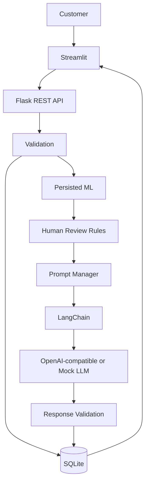

# AI-Powered Customer Support & Operations Assistant

A production-oriented end-to-end customer-support application combining Flask REST APIs, SQLite/SQL, scikit-learn text classification, LangChain, an OpenAI-compatible LLM provider, a deterministic mock LLM, authentication/authorization, rate limiting, and Streamlit.

## Overview
The system accepts a customer issue, validates and stores it, predicts category and priority with persisted ML pipelines, determines whether human review is required, constructs a controlled prompt, generates an AI-assisted response, stores the interaction, accepts feedback, and exposes operational analytics.

## Problem statement
Support teams need a consistent way to triage incoming requests while retaining human oversight for high-risk cases. This application demonstrates a complete workflow with auditable persistence and replaceable AI components.

## Objectives
- Automate first-pass ticket classification.
- Provide controlled AI-assisted responses.
- Preserve human review for critical/high-risk cases.
- Persist operational and AI interaction data.
- Provide REST and Streamlit interfaces.
- Keep training, inference, and deployment reproducible.

## Features
- Flask REST API
- SQLite with parameterized SQL
- Ticket/category/priority ML classification
- TF-IDF + Logistic Regression
- Reproducible dataset generation
- Accuracy/precision/recall/F1/classification reports/confusion matrices
- Priority queue using `heapq`
- OOP service architecture
- LangChain LLM workflow
- OpenAI-compatible provider
- Mock LLM mode without an API key
- Prompt versioning
- AI response validation and fallback
- Streamlit UI
- Feedback and analytics
- Pytest suite
- Gunicorn deployment configuration

## Technology stack
Python, Flask, SQLite, SQL, Pandas, NumPy, scikit-learn, LangChain, langchain-openai, Streamlit, pytest, Gunicorn.

## Architecture


## Application workflow
1. Validate customer ID and message.
2. Create/reuse a customer record.
3. Insert ticket with SQL.
4. Run persisted category/priority models.
5. Apply human-review rules.
6. Store prediction audit record.
7. Build versioned prompt.
8. Invoke LangChain-backed provider.
9. Validate or safely fall back.
10. Store AI interaction.
11. Retrieve ticket/analytics.
12. Store customer feedback.

## Project structure
```text
ai-support-assistant/
├── app/
│   ├── api/
│   ├── models/
│   ├── prompts/
│   ├── services/
│   └── utils/
├── ml/
├── data/raw/
├── data/processed/
├── models/
├── streamlit_app/
├── tests/
├── scripts/
├── docs/
├── .env.example
├── .gitignore
├── requirements.txt
└── run.py
```

## Dataset
`ml/data_generator.py` creates 2,400 realistic structured tickets across Billing, Technical, Account, Subscription, Payment, and Other, with Low/Medium/High/Critical priorities. It writes `data/raw/support_tickets.csv`. The generator is deterministic by default (`seed=42`), uses varied support language and a small explicit label-noise component, and does not hard-code model predictions. The dataset is a development benchmark, not evidence of real-world model performance.

## ML pipeline
Pandas loads the dataset; preprocessing removes missing/duplicate records and normalizes text. Scikit-learn pipelines combine TF-IDF with Logistic Regression. Category and priority are trained separately and persisted with joblib.

## Model training
```bash
python -m ml.data_generator
python -m ml.train
```

## Model evaluation
```bash
python -m ml.evaluate
```
Evaluation writes `data/processed/evaluation.json` and reports the ML models alongside a majority-class baseline. Do not treat the generated-data score as meaningful evidence of production accuracy; benchmark on reviewed historical support data before deployment.

## DSA implementation
`PriorityQueueManager` uses a binary heap (`heapq`) keyed by Critical → High → Medium → Low. A set prevents duplicate queue entries. Dictionaries are used for priority ranks and analytics aggregation.

## OOP architecture
Core classes include `DatabaseManager`, `TicketService`, `MLPredictor`, `LLMService`, `PromptManager`, `PriorityQueueManager`, and `AnalyticsService`. Composition is used to assemble services; inheritance is limited to the provider interface because it represents a real interchangeable-provider contract.

## Database schema
See `docs/database.md`. SQLite has `users`, `tickets`, `predictions`, `ai_interactions`, and `feedback`, with foreign keys and useful indexes.

## REST API
See `docs/api.md`. Main endpoints:
- `POST /api/tickets`
- `GET /api/tickets/<ticket_id>`
- `POST /api/predict`
- `POST /api/generate-response`
- `POST /api/process-ticket`
- `POST /api/feedback`
- `GET /api/analytics`
- `GET /health`

## LLM architecture
The LLM layer is provider-agnostic. `OpenAIProvider` uses `langchain-openai`; `MockLLMProvider` enables offline/local execution. Credentials are read only from environment variables.

## Prompt engineering
Prompts live in `app/prompts/`, are versioned by `PromptManager`, and explicitly constrain unsupported claims, sensitive-data requests, guarantees, and internal-detail disclosure.

## LangChain workflow
Ticket context → prompt template → LangChain chat model/provider → output → response validation → safe fallback if needed.

## Human-review logic
Critical predictions or high-risk terms (for example suspected fraud, unauthorized activity, legal or security concerns) set `human_review_required`. The application does not treat that flag as an autonomous approval/denial decision.

## Security considerations
- Bearer-token authentication is required for application APIs.
- Customer users can access only their own tickets; admin-only analytics/review routes are protected by role checks.
- Passwords are salted and hashed with `hashlib.scrypt`.
- A simple in-process rate limiter protects API traffic; production deployments should use a shared gateway/Redis limiter.
- Secrets are environment variables.
- `.env` is ignored by Git.
- SQL uses parameters.
- Input sizes are bounded.
- Provider exceptions are not exposed.
- Prompt rules prohibit exposing internal details.
- No credentials are stored in the repository.

## Testing
Run the full development suite:
```bash
pip install -r requirements/dev.txt
pytest
```
The suite covers database CRUD/transactions, authentication, authorization boundaries, validation, prompt rendering, LLM validation/mock behavior, priority review ordering, analytics shape, and REST API behavior. ML end-to-end tests require the runtime ML dependencies and trained model artifacts; they are intentionally kept separate from unit tests so a clean clone does not silently claim trained-model coverage.
The tests cover database CRUD, validation, priority queue behavior, mock LLM behavior, and REST endpoints. ML training/evaluation is reproducible through the commands above.

## Installation

### Create virtual environment
```bash
python -m venv .venv
```

### Activate — Windows
```bash
.venv\Scriptsctivate
```

### Activate — Linux/macOS
```bash
source .venv/bin/activate
```

### Install runtime dependencies
```bash
pip install -r requirements/runtime.txt
```

For development and testing:
```bash
pip install -r requirements/dev.txt
```

## Environment configuration
Copy `.env.example` to `.env` and adjust values:
```text
OPENAI_API_KEY=
OPENAI_MODEL=gpt-4o-mini
DATABASE_PATH=data/support.db
MODEL_DIR=models
PROMPT_DIR=app/prompts
MOCK_LLM=true
API_BASE_URL=http://127.0.0.1:5000
SECRET_KEY=replace-me
```
For local development, keep `MOCK_LLM=true`. To use an OpenAI-compatible provider, provide the appropriate key and set `MOCK_LLM=false`.

## Database initialization
```bash
python scripts/init_db.py
```

Create a controlled administrator account for analytics/review operations:
```bash
python scripts/create_admin.py
```

## Generate dataset
```bash
python -m ml.data_generator
```

## Train model
```bash
python -m ml.train
```

## Evaluate model
```bash
python -m ml.evaluate
```

## Run Flask
Development:
```bash
python run.py
```
Production WSGI:
```bash
gunicorn run:app --bind 0.0.0.0:5000
```

## Run Streamlit
```bash
streamlit run streamlit_app/app.py
```
Set `API_BASE_URL` to the deployed Flask URL when frontend/backend are separate.

## API usage examples

Create/process a ticket:
```bash
curl -X POST http://127.0.0.1:5000/api/process-ticket ^
  -H "Content-Type: application/json" ^
  -d "{"customer_id":"CUST-100","message":"My card payment was declined."}"
```

Get a ticket:
```bash
curl http://127.0.0.1:5000/api/tickets/1
```

Submit feedback:
```bash
curl -X POST http://127.0.0.1:5000/api/feedback ^
  -H "Content-Type: application/json" ^
  -d "{"ticket_id":1,"rating":5,"comments":"Helpful."}"
```

## Deployment
The Flask app is WSGI-compatible and can be deployed with Gunicorn on platforms that support Python web services. Streamlit can run as a separate service and should receive the backend URL through `API_BASE_URL`.

Before production deployment:
1. Use a production secret key.
2. Set `MOCK_LLM=false` only when a valid provider credential is securely configured.
3. Train using representative reviewed data.
4. Configure persistent storage appropriate to the deployment platform.
5. Add authentication/rate limiting before exposing the API publicly.
6. Restrict CORS/network access at the hosting layer as required.

## Limitations
- The included dataset is synthetic and intended for reproducible development.
- SQLite is suitable for this project and small deployments but may not be the best choice for high-concurrency production workloads.
- ML confidence calibration and model drift monitoring are not included.
- Authentication/authorization is intentionally outside the core demonstration.

## Future improvements
- PostgreSQL deployment adapter
- Authentication and RBAC
- Model confidence thresholds
- Human-review queue UI
- Retrieval-augmented knowledge base
- Structured observability and tracing
- Real historical support data and drift monitoring


## Authentication
Register and log in through `/api/auth/register` and `/api/auth/login`. Use the returned bearer token on protected endpoints:
```text
Authorization: Bearer <access_token>
```
Customer users are restricted to their own tickets. Analytics and the human-review queue require the `admin` role. For a real deployment, provision admin accounts through a controlled administrative workflow rather than allowing public self-registration as admin.

## Human-review queue
Critical/high-risk tickets keep `human_review_required=true` once set. `GET /api/review-queue` is admin-only and returns unresolved review-required tickets ordered by priority. The escalation prompt is invoked when generating responses for review-required tickets.

## Transaction boundary
`POST /api/process-ticket` performs ticket creation, ML prediction persistence, and AI interaction persistence inside one SQLite transaction. If the workflow raises an exception, database writes roll back.

## Error handling and observability
Flask has JSON handlers for common HTTP errors and an application-level fallback handler. `MAX_CONTENT_LENGTH`, strict JSON/type validation, structured-safe error messages, and Python logging are enabled. Provider exceptions are not returned to clients.

## Runtime/dev dependency split
- `requirements/runtime.txt`: deployment/runtime dependencies with pinned versions.
- `requirements/dev.txt`: runtime plus pytest, coverage, and Ruff.
- `requirements.txt`: compatibility entry point that includes runtime dependencies.
