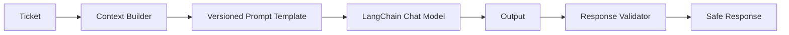

# AI Architecture

## Provider abstraction
`LLMProvider` defines the provider contract. `OpenAIProvider` uses LangChain's OpenAI-compatible chat integration. `MockLLMProvider` provides deterministic local operation when `MOCK_LLM=true` or no key is configured.

## Prompt engineering
Prompts are plain text files outside business logic. `response_prompt.txt`, `summary_prompt.txt`, and `escalation_prompt.txt` use explicit context fields and constraints against fabricated policies, guarantees, unnecessary sensitive-data requests, and internal-detail leakage. `PromptManager.VERSION` provides prompt versioning.

## Human review
Critical predictions and high-risk keywords such as suspected fraud, unauthorized activity, legal issues, or security breaches set `human_review_required=true`. This is a routing signal, not an autonomous decision to deny or approve a customer request.

## Validation and fallback
Provider failures, empty output, oversized output, and obvious secret/debug leakage result in a safe generic response. Provider exceptions are not returned to customers.

## Escalation prompt
When `human_review_required` is true, the escalation prompt is included in the LLM workflow before the customer response prompt. The generated customer response remains bounded by the response safety rules; the flag does not grant the model authority to resolve high-risk cases.

## Secret leakage validation
Response validation uses a pattern for OpenAI-style secret strings rather than the overly broad `sk-` substring check. Debug traces, API-key-like assignments, and empty/oversized responses are rejected.
