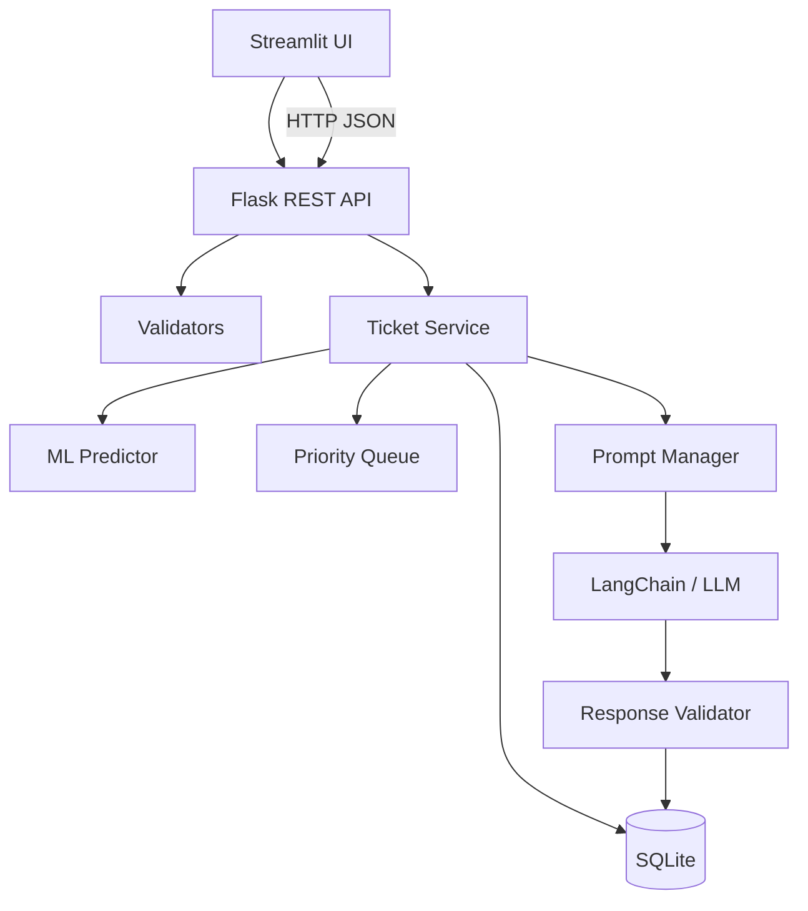

# Architecture

## Request flow
`POST /api/process-ticket` validates the request, creates a user/ticket using parameterized SQL, runs persisted ML pipelines, applies human-review rules, builds a versioned prompt, invokes the configured LLM provider, validates the output, and stores the interaction.

## Separation of concerns
- API modules translate HTTP requests into service calls.
- Services contain business logic.
- DatabaseManager owns SQL and transaction boundaries.
- MLPredictor owns persisted-model inference.
- PromptManager owns external prompt templates and versions.
- LLMService abstracts provider selection.
- Streamlit is an API client, not a second business-logic implementation.

## DSA
PriorityQueueManager uses Python's `heapq`, giving efficient insertion/removal of the next highest-priority ticket. A set prevents duplicate queue entries.

## Security and request controls
Authentication uses signed, time-limited bearer tokens. Customer ticket access is scoped to the authenticated `user_id`; administrative analytics and review operations require the `admin` role. A process-local rate limiter provides basic abuse protection. For horizontally scaled deployments, move rate limiting to the API gateway or a shared store.

## Transactional workflow
The process-ticket service opens one SQLite transaction before inserting the ticket and keeps that transaction open through prediction persistence and AI interaction persistence. A provider failure falls back to a safe response, allowing the transaction to commit a complete auditable workflow; unexpected failures roll back all writes.
