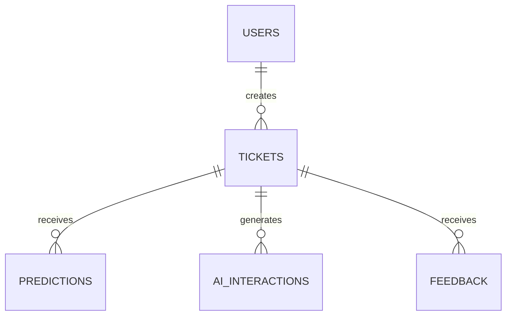

# Database

## Tables
- `users`: customer identity, password hash, and role.
- `tickets`: support request and operational state.
- `predictions`: immutable prediction records for auditability.
- `ai_interactions`: generated response history and prompt version.
- `feedback`: customer rating/comments.

## Relationships

Foreign keys are enabled per SQLite connection. Indexes cover status, priority, and ticket lookups.

## Important SQL
- Parameterized ticket insert: `INSERT INTO tickets(user_id, message) VALUES (?, ?)`
- Ticket lookup joins users: `SELECT ... FROM tickets t JOIN users u ON ... WHERE t.ticket_id = ?`
- Analytics uses grouped aggregates such as `SELECT category, COUNT(*) ... GROUP BY category`.

No user input is concatenated into SQL.

## Authentication fields
`users.password_hash` stores a salted scrypt password hash. `users.role` is `customer` or `admin`. Bearer tokens are signed and time-limited; raw tokens are not stored in SQLite.
